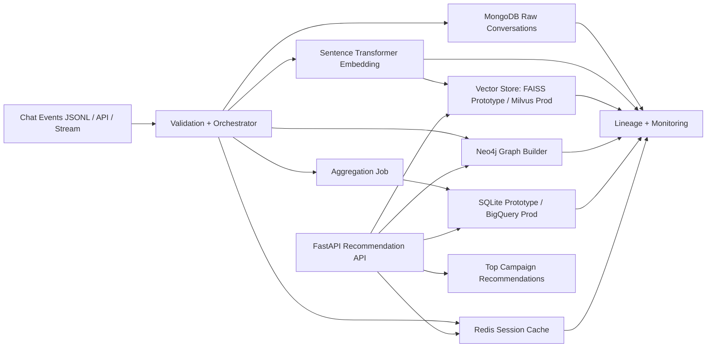

# Architecture Diagram

## Flow Notes
1. User chat events enter the orchestrator.
2. Data is schema-validated and written to MongoDB.
3. Text is embedded and pushed to the vector store.
4. Relationships between users, campaigns, and intents are updated in Neo4j.
5. Batch aggregation writes engagement metrics to SQLite/BigQuery.
6. Recent sessions are cached in Redis.
7. The API composes vector + graph + analytics for hybrid recommendations.
